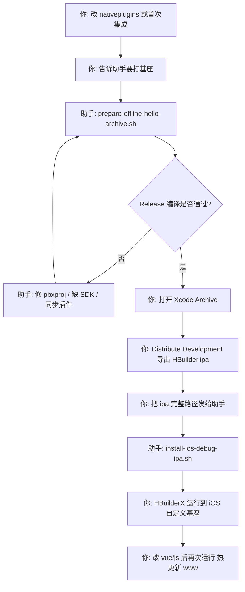

# 离线 iOS 自定义基座 — 完整协作说明

> 离线 iOS 自定义基座的**唯一主文档**：分工、脚本说明、常见问题。  
> 链路：改 nativeplugins → 助手 `prepare` → 你 Xcode Archive → 助手 `install-ios-debug-ipa` → HBuilderX 自定义基座运行。

---

## 速查：谁做什么

| 步骤 | 你 | 助手（Cursor） |
|------|-----|----------------|
| 1 | 改 `nativeplugins` 或说「要打基座」 | `prepare-offline-hello-archive.sh` |
| 2 | Xcode **Archive → Development** 导出 ipa | 修编译 / 缺 SDK |
| 3 | 发 ipa **完整路径** | `install-ios-debug-ipa.sh` |
| 4 | HBuilderX **运行到 iOS 自定义基座** | 协助排查热更新 |

**不要**常规跑 `setup-offline-hello.sh`（www 用热更新即可）。**不要**用 zip 改 ipa 代替 Archive。

---

## 一、先分清三件事（容易混）

| 名词 | 是什么 | 要不要每次做 |
|------|--------|----------------|
| **生成本地打包 App 资源** | HBuilderX：发行 → 原生 App-本地打包 → 生成 `unpackage/resources/__UNI__xxx/www` | **不必**（见下文「推荐链路」） |
| **打自定义基座 ipa** | Xcode Archive 把 **原生插件 + 穿山甲/分享 SDK** 编进 `HBuilder.ipa` | **仅当改了 `nativeplugins` 或 Xcode 集成** |
| **运行到 iOS 自定义基座** | HBuilderX 用 `unpackage/debug/iOS_debug.ipa` 装/跑，并通过 WiFi **热更新 www** | **日常联调都做** |

**推荐约定（本工程已验证）：**

- 基座 ipa 里**不必**每次塞最新 Vue/JS；www 交给 HBuilderX **运行到自定义基座** 时同步（`control.xml` 里 `syncDebug="true"`）。
- 因此 **不要**在常规流程里跑 `setup-offline-hello.sh`（会把 www 拷进 Hello 再 Archive，慢且易和线上一致性搞混）。

你若仍习惯先做「生成本地打包资源」再交给助手，见本文 **§四（可选分支）**；**主流程以 §三为准**。

---

## 二、涉及的路径（固定）

| 角色 | 路径 |
|------|------|
| uni 工程（示例） | `/Users/lin/Documents/uni_app/mdunidemo/unidemo` 或 `uniapp_plugins_demo` |
| 原生插件源码 | 工程内 `nativeplugins/Modo-AdReward`、`nativeplugins/Modo-AppShare` |
| DCloud 离线 SDK / Xcode 工程 | `/Users/lin/Downloads/SDK/HBuilder-Hello/HBuilder-Hello.xcodeproj` |
| Hello 内插件（符号链接） | `HBuilder-Hello/Modo-AdReward` → uni 工程 `nativeplugins/.../ios` |
| 自定义基座 ipa（给 HBuilderX） | `<uni工程>/unpackage/debug/iOS_debug.ipa` |
| Archive 导出（你桌面） | 如 `/Users/lin/Desktop/HBuilder 2026-06-02 18-12-16/HBuilder.ipa` |
| appid | `__UNI__9F05C09` |
| Bundle ID | `cn.modocommunity.ios` |
| 离线 appkey（Hello `HBuilder-Hello-Info.plist` → `dcloud_appkey`） | `1014d9d6768c562b1c9e91e18421c3f3`（[DCloud 开发者中心](https://dev.dcloud.net.cn/) → 应用 `__UNI__9F05C09` → 离线打包 Key） |

**注意：** `prepare-offline-hello-archive.sh` 默认从 **`mdunidemo/unidemo/nativeplugins`** 链到 Hello。若你主要在 `uniapp_plugins_demo` 改插件，Archive 前需保证 **mdunidemo 里插件与 demo 工程一致**（助手可帮你 `cp` 同步后再跑 prepare）。

---

## 三、推荐主流程（你 + 助手）



### 步骤 0 — 何时需要走全流程？

| 改动 | 要不要重做基座 |
|------|----------------|
| 只改 `.vue` / `.js` / `js_sdk` | **否** → 直接 HBuilderX 运行到自定义基座 |
| 改 `nativeplugins`（广告/分享原生代码、SDK 包） | **是** |
| 改 `setup-offline-hello-plugins.py` 或首次接插件 | **是** |
| 换穿山甲/微信/抖音等 SDK 包 | **是**（先 `copy-*-sdk` 脚本，再 prepare） |

---

### 步骤 1 — 你：说明要打基座（可选：生成本地资源）

**你通常做：**

1. 在 HBuilderX 打开 uni 工程，确认 `manifest.json` 已勾选原生插件。
2. （可选）**发行 → 原生 App-本地打包 → 生成本地打包 App 资源**  
   - 产物：`unpackage/resources/__UNI__9F05C09/www`  
   - **主流程不依赖这一步**；只有要把 www **写进 Hello 再 Archive** 时才需要（§四）。
3. 对助手说：「要打离线 iOS 基座 / 原生插件有更新」，并说明改的是 **mdunidemo** 还是 **uniapp_plugins_demo**。

**助手（Cursor）通常做：**

- 确认 `nativeplugins` 完整（例如 AppShare 的 `WechatOpenSDK-NoPay.xcframework` 不能缺）。
- 若 demo 工程与 mdunidemo 不一致，**同步** `nativeplugins` 到 `mdunidemo/unidemo`。
- 执行 **§五.1** `prepare-offline-hello-archive.sh`（需要写 `Downloads/SDK/HBuilder-Hello` 的权限）。

**不会自动发生的事：**

- 助手跑 prepare **不会**替你在 HBuilderX 里点「生成本地打包资源」。
- prepare **不会**自动弹出 Xcode；最多在终端提示你 `open ...xcodeproj`。

---

### 步骤 2 — 助手：Archive 前准备（核心）

在 **`mdunidemo/unidemo`**（或已配置为同一套路径的工程）执行：

```bash
cd /Users/lin/Documents/uni_app/mdunidemo/unidemo
./scripts/prepare-offline-hello-archive.sh
```

**这一条命令内部等价于：**

| 子步骤 | 做什么 |
|--------|--------|
| `python3 scripts/setup-offline-hello-plugins.py` | 见 **§五.2** |
| `xcodebuild ... Release clean build` | 在 Hello 工程上试编译，尽早发现缺文件、符号错误 |

通过后终端会提示：**请你去 Xcode Archive**。

---

### 步骤 3 — 你：Xcode Archive（必须本人，因签名）

```bash
open /Users/lin/Downloads/SDK/HBuilder-Hello/HBuilder-Hello.xcodeproj
```

1. 选 **Any iOS Device (arm64)** 或真机目标（不要选 Simulator 做 Archive）。
2. **Signing & Capabilities**：Team / 描述文件与 Bundle ID `cn.modocommunity.ios` 一致。
3. **Product → Archive**。
4. **Distribute App → Development**（自定义调试基座用 Development，不是 App Store）。
5. 导出到桌面文件夹，得到 **`HBuilder.ipa`**。

**你为什么必须自己做：** Apple 签名、证书、钥匙串只有本机 Xcode 能完成，助手无法代 Archive。

---

### 步骤 4 — 你：把 ipa 路径发给助手

示例：

```text
Archive 好了，ipa 在：
/Users/lin/Desktop/HBuilder 2026-06-02 18-12-16/HBuilder.ipa
```

---

### 步骤 5 — 助手：安装到工程的「本地基座」路径

在**你实际用 HBuilderX 打开的工程**下执行（你最近用的是 `uniapp_plugins_demo`）：

```bash
/Users/lin/Documents/uni_app/uniapp_plugins_demo/scripts/install-ios-debug-ipa.sh \
  "/Users/lin/Desktop/HBuilder 2026-06-02 18-12-16/HBuilder.ipa"
```

或 mdunidemo：

```bash
./scripts/install-ios-debug-ipa.sh "/Users/lin/Desktop/.../HBuilder.ipa"
```

**脚本会：**

- 备份旧 `unpackage/debug/iOS_debug.ipa` → `iOS_debug.ipa.bak-时间戳`
- 复制新 ipa 为 `iOS_debug.ipa`
- `strings` 抽查是否编入 `ModoAdBannerHandler`、`bindAdSlot`、`ModoAppShareDouyinBridge` 等

**注意：** 这是**复制已签名 ipa**，不是 HBuilderX 里的「云打包」；也**不能**用 zip 改 ipa 内容代替（见 **§五.6** `repack-ios-debug-ipa.sh`）。

---

### 步骤 6 — 你：HBuilderX「运行到 iOS 自定义基座」（你说的「本地基座编译」）

1. 用 HBuilderX 打开 **同一个** uni 工程（与 `iOS_debug.ipa` 所在工程一致）。
2. **运行 → 运行到手机或模拟器 → 运行到 iOS App 基座**。
3. 勾选 **使用自定义基座运行** → **本地基座** → 选 `unpackage/debug/iOS_debug.ipa`。
4. iPhone 与 Mac **同一 WiFi**；运行后 **杀掉 App 再打开**（确保 www 热更新生效）。

此时 HBuilderX 会：

- 用自定义基座 ipa 安装/启动壳子；
- 编译当前工程的 `unpackage/dist/dev/app-plus` 并通过 **syncDebug** 推到手机（**不必**为改 JS 再 Archive）。

**仅改 Vue/JS 时：** 重复步骤 6 即可，**不要**再 Archive。

---

## 四、可选分支：你先「生成本地打包资源」再交给助手

适合你坚持 **www 也打进 ipa / Hello 工程** 的场景（调试方式 B，较慢）：

| 步骤 | 谁 | 动作 |
|------|-----|------|
| 1 | 你 | HBuilderX：**发行 → 原生 App-本地打包 → 生成本地打包 App 资源** |
| 2 | 你 / 助手 | 跑 `setup-offline-hello.sh`（**§五.3**）→ 把 `resources/__UNI__xxx/www` 拷进 `Hello/Pandora/apps/...` |
| 3 | 助手 | 再跑 `prepare-offline-hello-archive.sh`（插件进 Xcode） |
| 4 | 你 | Archive → 发 ipa 路径 |
| 5 | 助手 | `install-ios-debug-ipa.sh` |
| 6 | 你 | HBuilderX 自定义基座运行（此时 ipa 内 www 已较新，热更新仍可用） |

**与主流程差异：** 多做了 **www 写入 Hello**；日常联调仍建议主流程（§三），改 JS 只跑步骤 6。

---

## 五、`scripts/` 脚本说明（干什么、谁跑、何时跑）

脚本在 **`mdunidemo/unidemo/scripts/`** 与 **`uniapp_plugins_demo/scripts/`** 各有一份（逻辑相同，在对应工程根目录执行）。

### 5.1 主流程必用

| 脚本 | 作用 | 谁跑 | 何时 |
|------|------|------|------|
| **`prepare-offline-hello-archive.sh`** | 调用 `setup-offline-hello-plugins.py` + `xcodebuild` Release 验证 | **助手** | 每次改 native 准备 Archive 前 |
| **`install-ios-debug-ipa.sh`** | 把你 Archive 的 ipa 复制为 `unpackage/debug/iOS_debug.ipa` 并抽查符号 | **助手** | 你提供 ipa 路径后 |

### 5.2 被 prepare 自动调用的 Python

| 文件 | 作用 |
|------|------|
| **`setup-offline-hello-plugins.py`** | ① 软链 `Modo-AdReward`、`Modo-AppShare` 到 Hello；② 改 `HBuilder-Hello-Info.plist`（`dcloud_uniplugins`、抖音/支付宝 scheme、相册权限等）；③ 改 `project.pbxproj`（Compile Sources、Embed Frameworks、系统库、BUAdSDK/微信等 xcframework）；④ 修复误加到 Supporting Files 的引用 |

### 5.3 www / 本地资源（可选，主流程默认不用）

| 脚本 | 作用 | 谁跑 | 何时 |
|------|------|------|------|
| **`setup-offline-hello.sh`** | 把 `unpackage/resources/__UNI__xxx/www`（或 dev 产物）拷到 `Hello/Pandora/apps/...`，改 `control.xml` debug/syncDebug | 你或助手 | **仅**当你要把 www 打进 Hello 再 Archive；**常规不要跑** |
| **`sync-www-to-hello.sh`** | 把 HBuilderX「运行」生成的 `unpackage/dist/dev/app-plus` 同步到 Hello 的 `Pandora/apps/.../www` | 你或助手 | 不用 HBuilderX 热更新、改用 **Xcode ⌘R 直装 Hello** 调试 JS 时 |

### 5.4 拷贝第三方 SDK 进 `nativeplugins`（改 SDK 版本时）

| 脚本 | 作用 |
|------|------|
| **`copy-pangle-ios-sdk.sh`** | 穿山甲 BUAdSDK / CSJMediation 等进 `Modo-AdReward/ios` |
| **`copy-wechat-sdk-to-appshare.sh`** | 微信 OpenSDK xcframework → `Modo-AppShare/ios` |
| **`copy-qq-sdk-to-appshare.sh`** | QQ SDK → AppShare |
| **`copy-douyin-sdk-to-appshare.sh`** | 抖音 SDK → AppShare |
| **`copy-alipay-sdk-to-appshare.sh`** | 支付宝分享静态库 → AppShare |
| **`run-all-copy-appshare-sdk.sh`** | 依次跑上面四个 AppShare 拷贝 |

跑完后需要再走 **§三** 全流程重做基座。

### 5.5 其它

| 脚本 | 作用 | 注意 |
|------|------|------|
| **`strip-ios-simulator-slices.sh`** | 去掉 framework 里模拟器架构，减小体积 | 发包/集成前按需 |
| **`repack-ios-debug-ipa.sh`** | 解压 ipa，替换内嵌 www，再打包 | **⚠️ 会破坏签名，不能给 HBuilderX 安装**；仅对比/排查用 |
| **`pre-ios-cloud-pack.sh`** | 云打包前检查（plugins_demo 侧） | 走 DCloud 云打包时用，与离线 Xcode 链路不同 |

---

## 六、你 vs 助手 — 一张表记牢

| 环节 | 你 | 助手（Cursor） |
|------|-----|----------------|
| 改业务 Vue/JS | ✅ | 可改代码，但不必 Archive |
| manifest 勾选插件、证书、Apple 开发者账号 | ✅ | ❌ |
| HBuilderX 生成本地打包资源（可选） | ✅ | 可提醒，不代替点击 |
| `prepare-offline-hello-archive.sh` | 可看终端结果 | ✅ 执行、修编译错误 |
| Xcode Archive / 签名 / 导出 ipa | ✅ 必须本人 | ❌ |
| 提供 ipa **完整路径** | ✅ | 等你 |
| `install-ios-debug-ipa.sh` | 可自己跑 | ✅ 常代跑 |
| HBuilderX 运行到 iOS 自定义基座 | ✅ | ❌ |
| 真机 WiFi、杀进程重开、看 Demo 效果 | ✅ | 根据日志协助排查 |

---

## 七、常见问题

### Q1：我做了「生成本地打包资源」，助手还做了什么？

若只走 **§三主流程**：助手**没有**把你的 `resources/.../www` 拷进 Hello；只做了 **原生插件进 Xcode + 编译检查**。www 靠步骤 6 热更新。

若你走 **§四**：助手（或你）还会跑 **`setup-offline-hello.sh`** 把 www 写入 Hello。

### Q2：为什么 Archive 后还要 HBuilderX「运行到基座」？

- **ipa / 基座** = 带原生插件的 **壳**（Objective-C、SDK、签名）。
- **运行到基座** = 往壳子里灌当前工程的 **JS/Vue**（开发态热更新）。
- 两者分工不同；不是「HBuilder 再编译一次 ipa」，而是 **安装/更新运行包**。

### Q3：改一行 `.vue` 要不要重新 Archive？

**不要。** 保存后重新「运行到 iOS 自定义基座」即可。页面不变见 [HBuilderX跑没变化-排查.md](./HBuilderX跑没变化-排查.md)。

### Q4：`repack-ios-debug-ipa.sh` 能不能代替 Archive？

**不能。** 改 zip 会破坏签名，HBuilderX 会报证书无效。必须 **Archive → Development ipa → install-ios-debug-ipa.sh**。

### Q5：两个工程（mdunidemo / uniapp_plugins_demo）用哪个 ipa？

`install-ios-debug-ipa.sh` 写到**执行脚本时所在工程**的 `unpackage/debug/iOS_debug.ipa`。  
HBuilderX 请打开**同一工程**，否则基座路径对不上。

---

## 八、云打包备选（付费，不走 Xcode）

若不想维护 Hello 工程，可用 HBuilderX **发行 → 原生 App-云打包**：

1. 勾选 **打自定义调试基座**
2. 选 **传统打包**（非「快速安心打包」；本地原生插件必须上传编译）
3. 证书 Bundle ID：`cn.modocommunity.ios`
4. 产物一般为 `unpackage/debug/iOS_debug.ipa`，装机后同样勾选「使用自定义基座运行」

---

## 九、相关文档

| 文档 | 内容 |
|------|------|
| [HBuilderX跑没变化-排查.md](./HBuilderX跑没变化-排查.md) | 热更新不生效 |
| [README.md](./README.md) | 文档总目录 |

---

## 十、给助手的一句话指令（复制到 Cursor）

```text
请按 docs/离线iOS打包-完整协作说明.md §三执行：
1) 在 mdunidemo/unidemo 跑 prepare-offline-hello-archive.sh（all 权限）；
2) 若 uniapp_plugins_demo 的 nativeplugins 更新过，先同步到 mdunidemo；
3) 告诉我去 Xcode Archive；
4) 我发来 ipa 路径后，在 uniapp_plugins_demo 跑 install-ios-debug-ipa.sh；
5) 提醒我用 HBuilderX 自定义基座运行，且仅改 JS 不必再 Archive。
不要跑 setup-offline-hello.sh，除非我明确要求把 www 打进 Hello。
```
