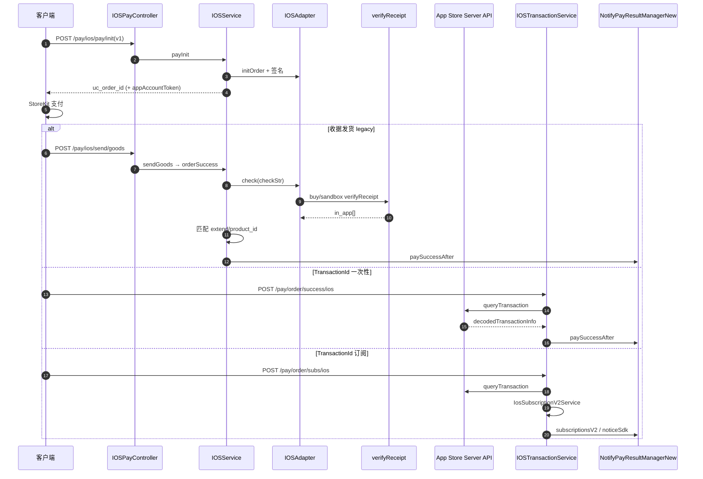
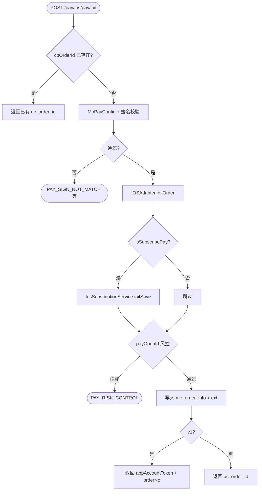
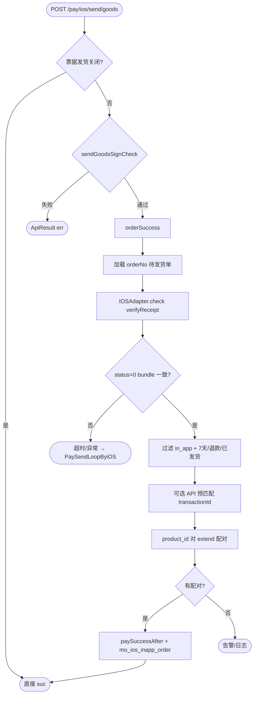
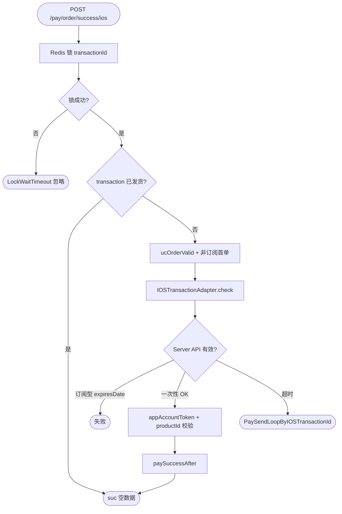
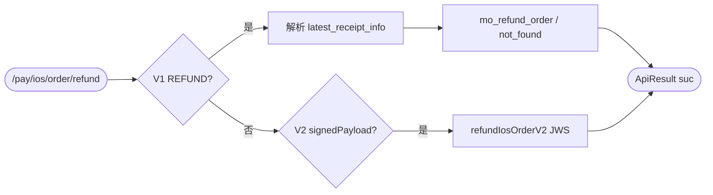

# Apple IAP 流程图（图示）

> **非 Normative**：验收以 [spec.md](./spec.md) 为准。

## 时序图（总览）

```mermaid
sequenceDiagram
    autonumber
    participant SDK as 客户端
    participant Init as IOSPayController
    participant IOS as IOSService
    participant Adp as IOSAdapter
    participant AppleR as verifyReceipt
    participant AppleAPI as App Store Server API
    participant Tx as IOSTransactionService
    participant Game as NotifyPayResultManagerNew

    SDK->>Init: POST /pay/ios/pay/init(v1)
    Init->>IOS: payInit
    IOS->>Adp: initOrder + 签名
    IOS-->>SDK: uc_order_id (+ appAccountToken)

    SDK->>SDK: StoreKit 支付

    alt 收据发货 legacy
        SDK->>Init: POST /pay/ios/send/goods
        Init->>IOS: sendGoods → orderSuccess
        IOS->>Adp: check(checkStr)
        Adp->>AppleR: buy/sandbox verifyReceipt
        AppleR-->>Adp: in_app[]
        IOS->>IOS: 匹配 extend/product_id
        IOS->>Game: paySuccessAfter
    else TransactionId 一次性
        SDK->>Tx: POST /pay/order/success/ios
        Tx->>AppleAPI: queryTransaction
        AppleAPI-->>Tx: decodedTransactionInfo
        Tx->>Game: paySuccessAfter
    else TransactionId 订阅
        SDK->>Tx: POST /pay/order/subs/ios
        Tx->>AppleAPI: queryTransaction
        Tx->>Tx: IosSubscriptionV2Service
        Tx->>Game: subscriptionsV2 / noticeSdk
    end
```

## 流程图（预下单）

```mermaid
flowchart TB
    A([POST /pay/ios/pay/init]) --> B{cpOrderId 已存在?}
    B -->|是| C[返回已有 uc_order_id]
    B -->|否| D[MoPayConfig + 签名校验]
    D --> E{通过?}
    E -->|否| Z([PAY_SIGN_NOT_MATCH 等])
    E -->|是| F[IOSAdapter.initOrder]
    F --> G{isSubscribePay?}
    G -->|是| H[IosSubscriptionService.initSave]
    G -->|否| I[跳过]
    H --> J{payOpenId 风控}
    I --> J
    J -->|拦截| Z2([PAY_RISK_CONTROL])
    J -->|通过| K[写入 mo_order_info + ext]
    K --> L{v1?}
    L -->|是| M[返回 appAccountToken + orderNo]
    L -->|否| N[返回 uc_order_id]
```

## 流程图（收据 send/goods）

```mermaid
flowchart TB
    A([POST /pay/ios/send/goods]) --> B{票据发货关闭?}
    B -->|是| S([直接 suc])
    B -->|否| C{sendGoodsSignCheck}
    C -->|失败| E([ApiResult err])
    C -->|通过| D[orderSuccess]
    D --> F[加载 orderNo 待发货单]
    F --> G[IOSAdapter.check verifyReceipt]
    G --> H{status=0 bundle 一致?}
    H -->|否| R([超时/异常 → PaySendLoopByiOS])
    H -->|是| I[过滤 in_app + 7天/退款/已发货]
    I --> J[可选 API 预匹配 transactionId]
    J --> K[product_id 对 extend 配对]
    K --> L{有配对?}
    L -->|是| M[paySuccessAfter + mo_ios_inapp_order]
    L -->|否| W([告警/日志])
    M --> S
```

## 流程图（TransactionId 一次性）

```mermaid
flowchart TB
    A([POST /pay/order/success/ios]) --> B[Redis 锁 transactionId]
    B --> C{锁成功?}
    C -->|否| X([LockWaitTimeout 忽略])
    C -->|是| D{transaction 已发货?}
    D -->|是| S([suc 空数据])
    D -->|否| E[ucOrderValid + 非订阅首单]
    E --> F[IOSTransactionAdapter.check]
    F --> G{Server API 有效?}
    G -->|订阅型 expiresDate| Z([失败])
    G -->|一次性 OK| H[appAccountToken + productId 校验]
    H --> I[paySuccessAfter]
    I --> S
    G -->|超时| Q([PaySendLoopByIOSTransactionId])
```

## 流程图（退款推送）

```mermaid
flowchart LR
    A([/pay/ios/order/refund]) --> B{V1 REFUND?}
    B -->|是| C[解析 latest_receipt_info]
    C --> D[mo_refund_order / not_found]
    B -->|否| E{V2 signedPayload?}
    E -->|是| F[refundIosOrderV2 JWS]
    D --> G([ApiResult suc])
    F --> G
```
