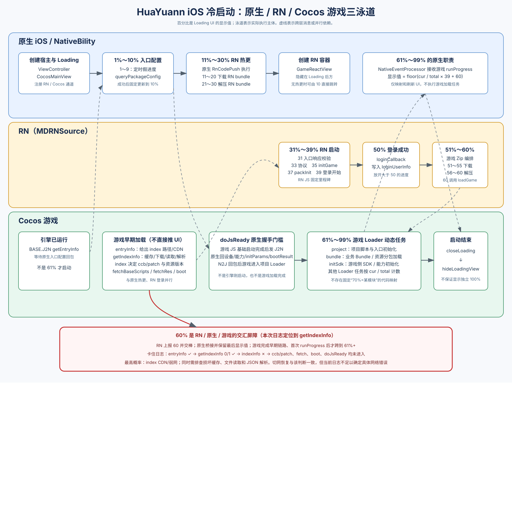

# 花园 iOS 游戏启动流程与进度说明

> 更新时间：2026-08-19  
> 当前依据：HuaYuann、NativeBility 本地源码、`MDRNSource 3.3.2.55`、当前打包 `GameResource/main.js`。  
> 核心规则：下文把**实际执行主体**、**进度上报主体**、**Loading UI 刷新位置**分开描述。



## 一、先看结论：各进度段到底属于谁

| 屏幕进度 | 实际执行主体 | 正在做什么 | 谁计算/上报百分比 | 最终谁刷新 UI |
|---:|---|---|---|---|
| 0%～10% | **原生 NativeBility** | 创建 Loading、ATT/网络门控、请求 `pack/queryPackageConfig` | `CocosMainView`：1～9 为定时假进度，接口成功固定到 10 | `CocosMainView → LoadingView` |
| 11%～30% | **原生 NativeBility 的 `RnCodePush`** | 对 **RN bundle** 做热更下载和解压 | `CocosMainView.m` 根据 CodePush 的 `cur/max` 映射到 11～20、21～30 | `CocosMainView → LoadingView` |
| 31%～50% | **RN JS（MDRNSource）** | 入口响应校验、协议、`initGame`、`packInit`、账号登录 | RN 调用 `game-cocos.updateProgressAndState` | `PluginAdapter_game_cocos → Data_updateProgress → CocosMainView` |
| 51%～60% | **RN 编排 + 原生文件能力执行** | 下载、解压**游戏 Zip**；与前面的 RN bundle 不是同一资源 | RN 把游戏 Zip 进度压缩为 51～55、56～60，并调用 `loadGame` | 同上 |
| 61%～99% | **Cocos 游戏 Loader** | `project`、业务 `bundle`、`initSdk` 等游戏初始化任务 | 游戏发 `runProgress(cur,total)`；原生映射为 `cur/total×39+60` | `NativeEventProcessor → PluginAdapter_game_cocos → CocosMainView` |
| Loading 消失 | **Cocos 游戏发结束事件，原生执行关闭** | 游戏确认可结束启动页 | Cocos 发 `closeLoading`，不是固定的“100% 数字” | 原生 `hideLoadingView` |

必须特别区分：

- 11%～30% 虽然处理的是 **RN bundle**，但执行代码在原生 `CocosMainView.m / RnCodePush`，不能写成“RN 自己下载”。
- 51%～60% 处理的是**游戏 Zip**。RN 负责流程编排和百分比上报，底层文件下载、解压通过原生能力完成。
- 61%～99% 是**游戏进度**。原生只接收、换算和刷新 Loading，RN 登录流程已经不是这一段的执行主体。

## 二、主入口：为什么以 CocosMainView.m 为核心

HuaYuann 的 `ViewController.mm` 创建：

```objc
CocosMainView *mainView = [[CocosMainView alloc] initBundle:bundle
                                            loadViewConfig:config
                                             withNoticEvent:...];
self.view = mainView;
```

因此，主项目的启动壳实际由能力 SDK 中的 `CocosMainView.m` 控制。它在 `configViewBundle` 中依次完成：

```text
创建 LoadingView
→ registerEmitter（监听 loadGame、进度更新等）
→ registerCocosChannel（注册 Cocos J2N 通道）
→ startFlow（进入 ATT、网络和入口接口流程）
```

`CocosMainView` 是总协调者，但不代表所有任务都是原生任务：

- 原生阶段由它直接执行；
- RN 阶段由它创建的 `GameReactView` 执行，再把进度事件回传；
- 游戏阶段由它承载的 Cocos 引擎执行，再通过 J2N/NativeEventProcessor 回传。

## 三、0%～30%：原生阶段

### 0%～10%：入口配置

`CocosMainView.startFlow` 经 `NBEntryFlowCoordinator` 处理 ATT、网络状态和请求幂等，然后调用 `NBEntryRequestService` 请求：

```text
pack/queryPackageConfig
```

| 数值 | 代码含义 |
|---:|---|
| 0% | LoadingView 刚创建 |
| 1%～9% | `updateFirstProgress` 每 0.2 秒加 1，最多到 9；只是等待动画，不是接口完成比例 |
| 10% | `handleResponse` 已收到有效入口响应，停止定时器并固定更新为 10 |

入口响应包含 `entryConfig`、`gameConfig`、`rnConfig`、`bundleConfig` 等。`handleResponse` 同时做两件互相独立的事：

1. 把 `entryConfig + appInfo` 交给 `DataSyncManager`，等待下发给 Cocos；
2. 调用 `updateBudleWithResponse`，开始 RN bundle 热更或直接创建 RN 容器。

### 11%～30%：原生执行 RN bundle 热更

对应 `CocosMainView.m` 的 `updateBudleWithResponse`：

```text
download：floor(cur / max × 10) + 10  → 11%～20%
unzip：   floor(cur / max × 10) + 20  → 21%～30%
```

这段的准确名称是：**原生 NativeBility 对 RN bundle 执行 CodePush 热更**。

满足以下条件才执行：

- `bundleConfig` 非空；
- `updateMode == immediate`；
- 非 aud 环境；
- 非本地 RN 模式 `RnUseType == 2`。

否则跳过热更，直接 `rnCodePushCompleteWithResponse → creatView`。因此 10% 可以直接跳到约 30%/31%。

`creatView` 创建隐藏的 `GameReactView`。此时 RN JS 才开始运行自己的启动流程。

## 四、31%～60%：RN 流程，但要区分 RN bundle 与游戏 Zip

### 31%～50%：RN JS 启动和登录

当前 `MDRNSource 3.3.2.55/main.jsbundle` 可确认的固定节点如下：

| 数值 | RN 代码节点 | 含义 |
|---:|---|---|
| 31% | `showSdkMaintenance` 前后 | 读取并校验 `queryPackageConfig` 的响应状态、维护状态 |
| 33% | `launchProtocol` | 判断或展示启动隐私协议 |
| 35% | `initGame` | 安装游戏通信监听，准备 RN 与游戏交互 |
| 37% | `openLoadingDlg` | 打开 RN Loading 流程，随后进入 `packInit` |
| 39% | `packInit` 后调用登录 | 正式开始账号登录/授权流程 |
| 40%～49% | 无固定逐点映射 | 登录进行中；当前包没有每个整数对应的独立业务节点 |
| 50% | `loginCallback` | 登录成功，写入 `loginUserInfo`，上报 `officialLoginSuc` |

当前 RN 包中没有检出旧图里的 `loginByAppId`，所以不能继续把 41%～50% 固定命名为 `loginByAppId`。

### 51%～60%：游戏 Zip，不是 RN bundle

RN 收到游戏 Zip 的下载/解压事件后，把连续进度压缩为五档：

```text
档位 = clamp(ceil(5 × cur / max), 1, 5)

type == download → 50 + 档位 → 51%～55%
type == unzip    → 55 + 档位 → 56%～60%
```

准确归属是：

- **资源对象**：游戏 Zip；
- **流程编排与百分比计算**：RN；
- **文件下载/解压执行**：原生文件能力；
- **Loading UI 更新**：RN 调用 `game-cocos.updateProgressAndState`，NativeBility 最终刷新。

到 60% 后 RN 调用 `loadGame`。`PluginAdapter_game_cocos.loadGame` 会：

- 将 `kNTHasInitRN` 置为 `yes`；
- 发出 `Data_loadGame`；
- `CocosMainView` 收到后向 Cocos 通道发送 `RNReady`，放行此前积压的 RN/游戏消息。

60% 只表示 **RN 前置流程和游戏 Zip 准备已完成**，不是游戏初始化完成。

### 4.1 60% 是三层交汇的“屏障”，但不是三方共同计算的进度

可以把 60% 理解成一个**交接点和等待位**：RN、原生、Cocos 游戏三条链路在这里汇合，但三方并不是共同维护同一个 `progress = 60`。

| 层 | 到 60% 时已经做了什么 | 此时还在等什么 |
|---|---|---|
| RN | 登录成功；游戏 Zip 下载/解压完成；上报 60%；调用 `loadGame` | 等游戏真正进入 Loader；RN 不负责把 60 推到 61 |
| 原生 NativeBility | 执行文件下载/解压；接收 RN 的 60 并刷新 Loading；把 `loadGame` 转成 `RNReady` 发给 Cocos | 等游戏发 `runProgress`；在此之前没有新的可显示百分比 |
| Cocos 游戏 | 引擎可能已启动，并行请求 `entryInfo`、index 和启动资源 | 完成 `index → ccb/patch → fetch → boot → doJsReady`，然后产生首个 `runProgress` |

因此“卡 60%”的准确含义是：

> **Loading 最后一笔收到的可显示数值是 RN 上报的 60%；RN 已交棒，但游戏还没有产生下一笔 `runProgress`，原生只能继续显示 60%。**

这也是 60% 特别容易暴露问题的原因：同一个屏幕数字背后，既可能是 RN 尚未真正完成 `loadGame/RNReady`，也可能是游戏正在等待 entry/index/ccb/boot/doJsReady。定位时必须看日志断点，不能只按屏幕数字判断责任层。

## 五、Cocos 游戏从什么时候开始

Cocos 不是 61% 才开始。`CocosMainView` 本身承载 Cocos 引擎，启动早期就会从 `GameResource/main.js` 发：

```text
BASE.J2N / getEntryInfo
```

与此同时原生正在请求 `queryPackageConfig`。`DataSyncManager` 等待两个条件：

```text
network == YES                原生入口接口已成功
kNTHasInitRN == YES           此处表示 Cocos 已发 getEntryInfo
```

两者同时满足后，原生通过 `BASE.N2J` 回传 `entryInfo`，包括 `path`、`cdnList`、`appInfo` 等。

Cocos 随即执行当前 `GameResource/main.js` 明确定义的早期 phase：

| 游戏 phase | 具体内容 | 是否直接推动屏幕百分比 |
|---|---|---|
| `getIndexInfo` | 按 `entryInfo.path + cdnList` 下载并解析 index JSON | 否 |
| `fetchBaseScripts` | 按 index 下载或读取基础启动脚本 | 否 |
| `fetchRes` | 按 index 下载或读取启动资源 | 否 |
| `boot` | 加载 patch，完成 CCB boot，进入后续游戏 Loader | 否 |

这些 phase 会发 `setProgress`，但当前 `Channel_cocos.m` 的 `setProgress` 分支没有更新 `LoadingView`。所以屏幕显示 11%～60% 时，游戏早期加载可能已在并行执行，只是**没有占用这段 UI 百分比**。

### 5.1 从 60% 跨到 61% 的完整门槛

屏幕到 60% 后不会自动变成 61%。必须等游戏完成下面这条链路，并首次发出 `runProgress`：

```text
RN 完成游戏 Zip，并调用 loadGame
  → 原生向 Cocos 发 RNReady
  → entryInfo 已下发
  → getIndexInfo：取得并解析 index
  → 根据 index 决定 ccb/patch 版本并加载
  → fetchBaseScripts / fetchRes
  → boot
  → doJsReady
  → 游戏首次 runProgress
  → 原生才把屏幕从 60% 映射到 61%～99%
```

| 名称 | 它是什么 | 在 60% 后的职责 | 失败时的表象 |
|---|---|---|---|
| `entry` / `entryInfo` | 原生入口接口 `queryPackageConfig` 返回并下发给 Cocos 的启动入口 | 给出 `path`（本次为 `index/index-gn-mix-350.0.29.json`）、`cdnList`、应用与渠道信息；它告诉游戏“去哪里拿哪个 index” | 没有 `entryInfo:`，说明入口配置或原生到 Cocos 的同步尚未完成 |
| `index` | 服务端版本清单 JSON，不是游戏业务入口脚本 | 描述资源版本、文件清单、模块/Bundle、`verMap/jscVerMap` 以及所需 ccb/patch 版本；下载并解析成功后才知道下一步加载哪些文件 | 有 `progress getIndexInfo 0 1`，但没有 `indexInfo:`，界面可一直停在 60% |
| `ccb` | 随 App 携带的 Cocos Boot/补丁基础包，目录为 `GameResource/ccb` | 用本地 `version.json` 与 index 中的版本信息选择/加载 `patch.<jscVer>.jsc`，承接基础脚本、资源和 `boot`；当前包内版本为 `3.0.13`，patch 标识为 `f7f33` | index 已成功后，如果 patch 缺失、版本不匹配、文件损坏或执行异常，也会停在首次 `runProgress` 之前 |

三者是顺序关系：**entry 指向 index，index 决定资源与 ccb/patch，ccb/patch 再把游戏带入 Loader**。所以它们都可能造成“显示 60%”，但要按最后一条成功日志判断实际卡点，不能看到 60% 就统一归因给 ccb。

#### `doJsReady` 到底是什么

`doJsReady` 应理解为 **“游戏 JavaScript 已完成基础启动，向原生申请运行上下文的握手”**，而不是“Cocos 引擎刚刚创建完成”，也不是“整个游戏已经加载完成”。

发生顺序是：

```text
游戏完成 index / patch / 基础脚本 / 启动资源 / boot
  → 游戏通过 J2N 发送 doJsReady
  → Channel_cocos 把消息交给 NativeEventProcessor
  → NativeEventProcessor.doJsReady 组装原生运行上下文
  → 原生通过 N2J 回包给游戏
  → 游戏拿到能力和启动参数，继续项目 Loader
  → runProgress 开始推动 61%～99%
```

原生回给游戏的数据主要包括：

- `equipmentInfo`：设备、系统、网络等运行信息；
- `functionParameters`：当前原生实际开放给游戏的能力清单；
- `appVersion`、系统语言、游戏语言、国家和运营商；
- 游戏 Zip 的 `cdnList`；
- `initParams`：入口 URL、`userParams`；
- `ab.bootResult`、`bootPluginResult`：能力 SDK 和插件启动结果。

它解决的是两个问题：一是告诉原生“基础游戏 JS 已经能通信”；二是告诉游戏“当前 App、设备和 NativeBility 能提供什么”。如果没有发出 `doJsReady`，问题在它之前的游戏基础启动链；如果发出了但没有收到回包，则应查 J2N/N2J、`NativeEventProcessor` 或能力启动数据；如果握手完成但仍没有 `runProgress`，则查游戏项目 Loader 的首个任务。

### 5.2 本次 `/Users/lin/Desktop/进度60%` 日志结论

对 `60%进入游戏.txt` 与同目录 `100进度.txt` 的同版本成功样本进行对照：

| 节点 | 卡住样本 | 成功样本 |
|---|---|---|
| RN 上报 60% | 有 | 有 |
| Cocos 收到 `entryInfo:` | 有 | 有 |
| `progress getIndexInfo 0 1` | 有 | 有 |
| `indexInfo:` | **没有** | 有，随后立即继续 |
| `fetchBaseScripts / fetchRes / boot` | **没有** | 有 |
| `doJsReady / runProgress` | **没有** | 有 |

因此，这一份卡住样本可以确认：

1. RN 登录、游戏 Zip 下载/解压和 `loadGame` 已经走完，不能再把它归为“RN 卡 60%”。
2. 原生入口接口已经成功，`entryInfo` 也已送达 Cocos。
3. 首个未完成节点是 **`getIndexInfo`**：index 的缓存判断、CDN 下载、文件读取或 JSON 解析没有完成。
4. 本次尚未出现 `indexInfo`，所以 **ccb/patch 还没有进入可确认的执行阶段**；ccb 是一般性 60% 风险点，但不是这份日志证明的首个卡点。

结合“网络不好时切换网络即可继续”的用户现象，**index CDN 下载或连接恢复问题是当前最高概率方向**。代码中的 Downloader 单次超时为 30 秒，并会在 CDN 地址间重试；如果下载请求悬挂、DNS/连接未及时失败，或者网络切换后旧任务没有被明确取消并重建，界面就会保持在 60%。不过现有日志没有记录 index 的实际 URL、缓存命中、下载开始/结束、错误码、重试次数和 JSON 解析结果，因此目前只能定位到 `getIndexInfo`，还不能仅凭这一份日志区分以下子原因：

- CDN/DNS/弱网超时或连接悬挂；
- 本地 index 缓存文件存在但内容不完整；
- 文件读取失败；
- JSON 内容损坏或解析异常；
- 下载回调或失败重试没有最终收敛。

缓存校验当前主要依赖文件大小，且下载器存在多次大小不匹配后放行的逻辑，这会增加“缓存文件存在但不可用”的风险。后续代码优化应优先补充 `getIndexInfo` 的 URL（可脱敏）、缓存路径/命中、文件大小、下载耗时、HTTP/网络错误、CDN 序号、解析成功/失败日志，并增加明确超时、切网重建任务及损坏缓存删除后重试。

卸载 App 会清空沙盒中的 index 和下载缓存，所以如果卸载后恢复，支持“本地缓存异常”的可能性；普通 App 更新通常保留沙盒，更新后恢复也可能来自新版本内置 `main.js/ccb`、新的 index 路径或逻辑变化，**不能单凭卸载或更新后恢复就断言一定是缓存**。

### 5.3 屏幕进度是怎样产生并显示出来的

屏幕上的数字不是一个统一任务的真实完成比例，而是不同阶段的生产者依次把数值送到同一个原生 `LoadingView`。

```text
阶段生产者计算进度
  → 调用/桥接 updateProgressAndState
  → PluginAdapter_game_cocos 转成 Data_updateProgress 事件
  → CocosMainView 的 updateProgressListener 收到事件
  → LoadingView.updateCurrentProgressValue(progress)
  → 屏幕显示新数值
```

不同阶段的“生产者”不同：

| 显示区间 | 数值怎么产生 | 如何到达屏幕 |
|---:|---|---|
| 1%～9% | 原生定时器每 0.2 秒加 1，是等待动画 | `CocosMainView` 直接更新 `LoadingView` |
| 10% | 原生入口接口成功后固定写 10 | 同上 |
| 11%～30% | 原生把 RN bundle 下载/解压的 `cur/max` 映射到两个 10% 区间 | 同上 |
| 31%～50% | RN 的固定启动/登录里程碑 | RN → `updateProgressAndState` → 原生事件 → `LoadingView` |
| 51%～60% | RN 把游戏 Zip 下载/解压压缩为两个五档区间 | RN → 原生能力桥 → `LoadingView` |
| 60% 等待 | **没有新的显示事件**；游戏的 `setProgress(getIndexInfo/fetch/boot)` 当前不更新 Loading | UI 保留上一笔 60%，所以看起来“卡死” |
| 61%～99% | 游戏发 `runProgress(cur,total)`，原生算 `floor(cur/total × 39 + 60)` | 游戏 J2N → `NativeEventProcessor` → 原生能力桥 → `LoadingView` |
| 结束 | 游戏发 `closeLoading`，不要求先显示独立 100% | 原生隐藏 LoadingView |

这里最重要的是：**屏幕不动不等于所有代码都没运行，只表示没有新的进度显示事件到达 `LoadingView`。** 当前游戏早期的 `setProgress` 只用于阶段日志/上报，没有接到 UI 更新链，所以 index 下载即使正在重试，用户看到的仍然是 60%。

### 5.4 针对当前“无 `indexInfo`”日志的处理思路（暂不改代码）

当前证据只支持“卡在 `getIndexInfo`”，建议按下面顺序处理，避免先清全量缓存掩盖根因。

1. **先验证 index/CDN 可达性。** 从日志中的 `entryInfo.path` 取 `index/index-gn-mix-350.0.29.json`，分别拼接两条 `cdnList`，在故障设备所处网络请求；记录 DNS、建连、TLS、HTTP 状态、首包时间和文件大小。Wi-Fi 失败而蜂窝成功，或某一 CDN 单独失败，可直接缩小到网络/CDN。
2. **做单变量复现。** 同一台设备依次测试：原网络重启 App、只切换网络、只重启 App、不卸载；每次记录能否从 `getIndexInfo 0/1` 走到 `indexInfo`。切网立即恢复而重启无效，优先连接/DNS/下载任务；重启恢复则还要怀疑任务生命周期或偶发回调丢失。
3. **验证缓存假设。** 保留故障现场后，只清理本次 index 对应缓存再启动，不先卸载 App、不清整个游戏资源。如果恢复，说明 index 缓存高度可疑；如果仍失败，更偏向网络、读取或回调。由于现有版本缺少缓存路径日志，必要时可先通过调试包或沙盒导出确认目标文件。
4. **离线检查缓存文件。** 对故障设备导出的 index 检查文件是否存在、大小是否合理、是否能完整解析为 JSON、关键字段 `platformMap/verMap/jscVerMap/modules` 是否存在。能读取但不能解析属于损坏/截断缓存；文件正常则继续查下载完成后的读取和回调链。
5. **用成功样本作验收线。** 处理有效的最低标准不是“界面动了”，而是日志依次出现 `indexInfo → fetchBaseScripts → fetchRes → boot → doJsReady → runProgress`。

面向线上用户的临时处置可以是：先提示切换 Wi-Fi/蜂窝后重试；仍失败再重启 App；最后才建议清缓存或重装。重装能恢复但会清掉证据，不适合作为研发定位的第一步。

## 六、61%～99%：简要说明

`doJsReady` 握手完成后，游戏 Loader 加载 `project`、业务 `bundle`、`initSdk` 等动态任务，并发送 `runProgress(cur,total)`。原生只负责按 `floor(cur/total × 39 + 60)` 换算和显示，因此不存在固定的“某个百分比对应某个模块”。游戏最终发送 `closeLoading`，原生隐藏启动页；当前实现不要求先单独显示 100%。

## 七、按百分比定位责任层

| 卡点 | 第一责任层 | 先查代码/日志 |
|---:|---|---|
| 0%～9% | 原生 | `CocosMainView.startFlow`、ATT、网络、`NBEntryRequestService`、`[EntryRequest]` |
| 10% | 原生 | `handleResponse`、`DataSyncManager.tryToSend`、是否进入 `updateBudleWithResponse` |
| 11%～30% | 原生 RN 热更模块 | `RnCodePush` 的 `download/unzip cur/max`；是否满足 immediate 条件 |
| 31%～38% | RN | `showSdkMaintenance`、`launchProtocol`、`initGame`、`openLoadingDlg/packInit` |
| 39%～50% | RN 登录 | `loginCallback`、授权 UI、账号接口、`officialLoginSuc` |
| 51%～60% | RN 编排 + 原生文件能力 | 游戏 Zip 的 `type/cur/max/complete`、磁盘与解压错误、`loadGame` |
| 停在 60% | 优先查游戏早期链路，再核对 RNReady | 先找最后成功节点；本次样本停在 `getIndexInfo`，重点查 index CDN、缓存、读取和 JSON 解析 |
| 61%～99% | 游戏 Loader | `runProgress cur/total`、`project`、`bundle`、`initSdk`、初始化参数和 SDK 回调 |
| 99% 不消失 | 游戏结束事件 / 原生 UI | `closeLoading`、`hideLoadingView` |

## 八、代码依据

| 文件 | 本文使用的代码事实 |
|---|---|
| `/Users/lin/Documents/HuaYuann/native/engine/ios/ViewController.mm` | 主项目创建 `CocosMainView`，配置 `gameAdapter=cocos` |
| `/Users/lin/Documents/modo-native-ability-ios/NativeBility/NativeBility/View/GameMainView/CocosMainView.m` | Loading 创建、入口流程、1～10、RN CodePush 11～30、RN 容器、进度事件、loadGame 监听 |
| `.../View/GameMainView/NBEntryRequestService.m` | `queryPackageConfig` 首次并行、后续串行及重试 |
| `.../util/GameTool/DataSyncManager.m` | 网络响应与 Cocos `getEntryInfo` 双就绪下发 |
| `.../nt+ability/Communication/Channel_cocos.m` | 接收 `getEntryInfo`；`setProgress` 当前不更新 Loading |
| `.../Native/NativeEventProcessor.m` | `doJsReady` 回包、`runProgress` 映射公式、`closeLoading` |
| `.../nt+ability/Plugin/game/PluginAdapter_game_cocos.m` | `loadGame`、`updateProgressAndState`、`hideLoadingView` 桥接 |
| `/Users/lin/Documents/HuaYuann/build/ios/proj/Pods/MDRNSource/main.jsbundle` | RN 固定节点 31/33/35/37/39/50、游戏 Zip 51～60、RN 进度门控 |
| `/Users/lin/Documents/HuaYuann/native/engine/ios/GameResource/main.js` | CCB 的 `getIndexInfo/fetchBaseScripts/fetchRes/boot` 早期 phase |

> 版本边界：更新 NativeBility 分支、`MDRNSource` tag、服务端 index 或游戏包后，应重新核对节点。尤其 61%～99% 是动态任务计数，不能跨版本固化为一张百分比到模块的静态表。
